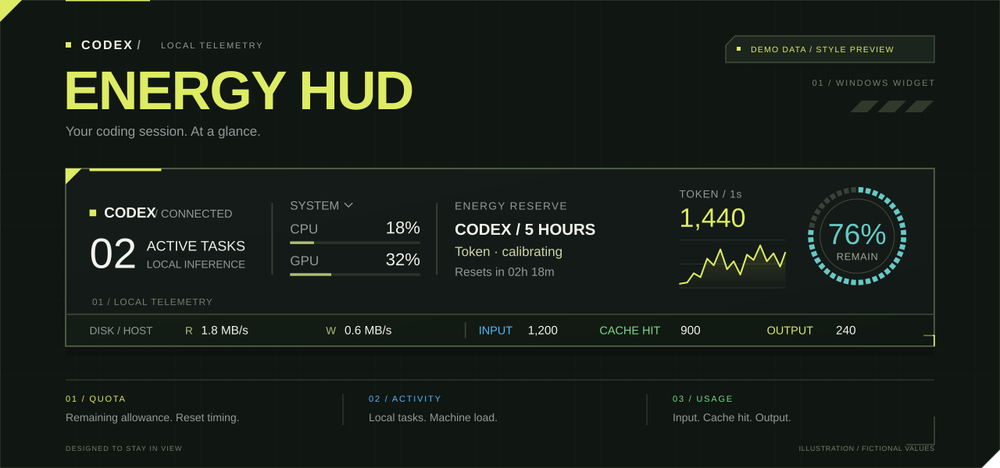

<div align="center">
  
  <h1>Codex 电量 HUD</h1>
  <p><strong>额度、任务、用量。留在桌面，一眼读懂。</strong></p>
  <p>Windows 原生悬浮挂件 · WPF / .NET 10 · v1.7.0</p>
  <p>
    <a href="#开始使用">开始使用</a> ·
    <a href="#操作速查">操作速查</a> ·
    <a href="#数据说明">数据说明</a> ·
    <a href="docs/architecture.md">架构与验证</a> ·
    <a href="docs/macos.md">macOS</a>
  </p>
</div>

> 首图是使用虚构数值绘制的界面示意。配色与布局沿用 widget，不含真实任务或账户数据。

## 01 / LOCAL TELEMETRY

深墨绿底色、荧光黄绿读数、细分隔线与切角控件。默认约 **654 × 134 DIP** 的悬浮条，将日常需要看的数据放在一起；详情按需展开。

| 模块 | 桌面上能看到什么 |
| --- | --- |
| **ENERGY / 剩余额度** | 剩余百分比圆环、额度池与周期选择、重置时间、可用重置卡，以及校准后的剩余 Token 估算 |
| **TASKS / 任务活动** | 任务状态、本轮时长与 Token 明细；审批、等待输入、完成及中断提醒 |
| **USAGE / 实时用量** | 最近 60 秒的整体输入＋输出曲线，以及逐任务输入、Cache hit、输出曲线 |
| **COST / 用量报告** | 会话累计 API 等效费用、本周期总计，以及可搜索、排序和展开子代理的独立报告 |
| **SYSTEM / 硬件采样** | 整机、Codex、对照三种 CPU/GPU 范围；内存、显存与整机磁盘读写速率 |
| **CONTROL / 桌面控制** | 置顶、锁定、缩放、不透明度、托盘与可选登录自启；设置自动保存 |

| 平台 | 当前范围 |
| --- | --- |
| **Windows x64 · 1.7.0** | WPF 主界面，提供上表功能；从源码构建运行 |
| **macOS · 1.7.3 源码实现** | Avalonia 界面已接入实时用量曲线、会话 API 等效费用、周期历史与报告、重置卡数量及校准恢复；本次未编译、运行或测试。GPU/显存及桌面实时审批/输入状态暂不可用。详见 [macOS 接手说明](docs/macos.md) |

<a id="开始使用"></a>
<a id="运行"></a>

## 02 / 开始使用

需要 **Windows x64**，并已安装、登录 Codex。挂件复用本机 Codex CLI 的只读接口，无需填写 API key。

### 从源码构建

首次准备需要 Node.js。安装脚本从微软官方下载 .NET SDK，验证 SHA-512 后放在本项目的 `.tools/dotnet`，不会替换全局 .NET。

在仓库根目录运行：

```powershell
node scripts/install-sdk.mjs
./scripts/build.ps1 -Publish
```

构建脚本会运行核心回归测试，输出在 `artifacts/release/CodexHud/`；运行时保留该目录中的全部依赖文件。代码分为共享数据层 `src/CodexHud.Core`、Windows WPF 界面 `src/CodexHud` 与 macOS Avalonia 界面 `src/CodexHud.Mac`；Windows 构建流程中的测试不依赖第三方测试框架。

构建完成后启动：

```powershell
./artifacts/release/CodexHud/CodexHud.exe
```

自包含构建自带 .NET 10，运行时无需另装运行时或管理员权限。初次窗口出现在主屏幕上方，默认置顶、登录自启关闭。关闭窗口会隐藏到托盘；从托盘菜单选择“退出”才会结束采集。

<a id="操作速查"></a>

## 03 / 操作速查

| 点击这里 | 执行这个操作 |
| --- | --- |
| **CODEX / 任务概况** | 展开任务、时长与 Token 明细 |
| **CPU 上方范围按钮** | 切换整机 → Codex → 对照 |
| **TOKEN 折线** | 展开最近 60 秒的逐任务用量 |
| **额度文字 / 右侧圆环** | 选择额度池和周期，查看估算与重置卡 |
| **本周期 → 总计卡** | 打开独立报告，搜索任务、选择历史周期 |
| **空白区域 / 右键** | 拖动窗口 / 打开设置；再次点击当前面板入口收起 |

<details>
<summary><strong>展开完整操作、状态色与提醒说明</strong></summary>

### 操作

| 位置 | 操作 |
| --- | --- |
| 左侧 CODEX / 任务概况 | 展开任务及本轮时长、Token、内存、显存详情；再次点击收起 |
| CPU 上方范围按钮 | 依次切换“整机 / Codex / 对照”；对照数字顺序为整机/Codex |
| 底部 DISK / 整机 | 查看所有本机物理磁盘的合计读写速率；右侧显示最近一个已结束的 1 秒 tick 的输入 / Cache hit / 输出，悬停查看精确整数和采集状态 |
| 额度圆环旁的用量折线 | 查看最近 60 秒整体输入＋输出；点击展开“用量”，再次点击收起 |
| 最右侧电量圆环或额度文字 | 展开额度池与周期选择；再次点击收起，选择自动保存 |
| 额度展开栏的重置卡 | 显示当前账户剩余重置卡张数，随额度刷新；缺失显示 —，旧数据标记已过期 |
| 额度区的预估 Token | 查看所选周期的剩余 Token 估算；展开额度面板查看经验范围和校准进度，悬停查看采样时段与计算说明 |
| 顶部、底部空白与分隔区域 | 拖动窗口；锁定位置后不可拖动 |
| 右键 | 设置、切换硬件范围、隐藏、退出 |
| 展开后的“设置” | 置顶、锁定、缩放、不透明度、登录自启，以及任务行累计费用显示开关 |
| 展开面板的任务／用量／本周期／额度／设置入口 | 再次点击当前入口收起；点击其他入口直接切换面板 |
| “用量”中的任务行 | 查看各任务的输入、Cache hit、输出数值及三条折线；所有行使用相同时间轴与纵轴尺度，子任务及归档任务单独标记 |
| 任务项中的 TOKEN 数值 | 查看本轮与任务自身累计；悬停查看精确明细、记录时间与有效性 |
| “任务”与“用量”行中的累计费用 | 主任务显示自身及已确认子代理的累计 USD 估算；子代理行显示自身，悬停查看分项、计价覆盖与价格来源 |
| 系统托盘图标 | 双击恢复；右键显示、隐藏或退出 |

圆环显示**剩余**百分比；CPU/GPU 显示**占用**百分比。圆环随剩余额度连续渐变：100%蓝色、50%绿色、25%及以下红色；数值变化时短暂过渡。主额度池只显示接口实际返回的周期，不固定假设“5小时额度”。所选额度消失时显示不可用，点击圆环重新选择。

任务列表与展开面板采用深色轨道、橄榄色滚动滑块，悬停和拖动时荧光高亮。设置中的勾选框、缩放与不透明度滑块采用相同切角样式，保留键盘焦点提示和原有控件操作。

界面中的长篇数据说明已移至悬停提示。日常只保留数值、校准中、数据不全、待确认与过期等必要状态；详细口径见下文。

### 任务变色与提醒

任务状态色与额度圆环分开显示：执行蓝色、需要审批橙色、等待输入紫色、完成绿色、中断红色、待确认灰色。列表中的完成/中断状态持续保留；新完成后主面板显示60秒提示，同时保留并行执行数量。再次运行同一任务会清除它上一轮的完成提示。

审批/输入等待默认弹出一条同风格的桌面提醒，6秒自动收起；点击可回到挂件对应任务，审批或回答仍在 Codex 中完成。完成/中断默认仅在挂件内变色，可在设置中开启桌面提醒。声音默认关闭，另有独立开关。

同一次请求不会反复提醒；启动时不补报历史完成，重新连接也不会重复已知请求。窗口隐藏到托盘后仍可提醒。任务活动面板面向本机顶层任务，具体实时覆盖数量可在任务面板悬停查看；独立“用量”面板也纳入最近产生用量的子任务及归档任务。

重置卡读取现有 [account/rateLimits/read 接口](https://learn.chatgpt.com/docs/app-server#6-rate-limits-chatgpt)的账户级 `rateLimitResetCredits.availableCount`，与所选额度池和周期无关。普通显示每60秒刷新，隐藏后每120秒；0表示明确没有可用卡，—表示接口未提供数量。详情列表可能截断，数量不按列表长度计算；这项显示不兑换重置卡。

</details>

<a id="数据说明"></a>

## 04 / 读数与数据边界

- **圆环是剩余额度**，CPU/GPU 是占用率；额度降低时由蓝、绿逐渐转红。
- **Token 总量 = 输入 + 输出**，Cache hit 已包含在输入中；每秒曲线统计首次观测到的本地记录，日志集中上报时会出现波峰。
- **剩余 Token 是本机近期估算**，首次需至少 3 段、合计下降 6 个百分点的有效样本；不足时显示“校准中”。
- **USD 是 API 等效费用估算**，不代表订阅扣款或账单；仅覆盖可验证的本机记录，主任务金额已包含已确认子代理。
- **未知数据保留未知**：`—` 表示不可用，`·` 表示部分或旧数据；无法确认实时任务状态时保留本地推断与“待确认”。

所有数据在本机处理。挂件不上传任务正文，不读取、导出或保存登录凭据，不启动任务、不响应审批、不兑换重置卡。

<details>
<summary><strong>实时 Token 用量、会话费用与本周期报告</strong></summary>

### 实时 Token 用量（Windows）

悬浮条中的约 80 × 80 DIP 折线区显示最近 **60 个已完成的 1 秒 tick**；整体数值为**输入＋输出**，Cache hit 已包含在输入中，不能再加一次。例如输入 100、Cache hit 80、输出 20 时，整体为 120。底部三项数值和任务行数值采用最近一个已结束的 tick，悬停可查看精确整数。

每个 tick 统计这一秒**首次观测到的本地用量记录**，不是模型实时生成速度。日志可能在响应结束后集中上报，因此会出现波峰；挂件不把这些 Token 平摊到此前秒数。新任务索引每 5 秒刷新，发现新任务可能有约 5 秒延迟。

“用量”面板显示现有任务列表中的任务，以及最近 60 秒产生用量的独立子任务和归档任务。输入、Cache hit、输出各有一条折线，所有任务共用时间轴和纵轴尺度，刷新保留行顺序与滚动位置。每个任务只计自身记录，不向父任务重复合并；纳入所有有有效本地记录的普通模型，排除明确标记为 `guardian_review` 的内部审批审查记录。

实时采集使用独立读取游标，每秒读取变化部分，不受剩余 Token 估算的模型筛选、额度重置及额外读取影响。启动前历史只建立基线，不产生启动波峰。读取完整且无新增记录显示 0；读取失败、预算不足、休眠或采样中断保留缺口或部分数据，不当作零。单个任务故障不清除其他任务历史。

每条曲线显示最近 60 秒，底层在内存保留 79 秒原始样本供 Mac 计算完整的 20 秒窗口，退出后不保存。隐藏到托盘后仍按秒采集，停止曲线绘制，恢复显示时呈现最新历史。此处说明 Windows 界面；macOS 1.7.3 也已接入整体和逐任务曲线，使用 20 秒平均速率、1 秒采集、60 秒显示窗口，尚待 Mac 实机验收。

### 本周期用量与详细报告（Windows）

展开面板中的“本周期”只显示当前统计周期、总 Token、API 等效费用估算（USD）以及更新时间和数据状态。点击总计卡打开独立、可调整大小的报告窗口；重复点击会唤回同一窗口。报告提供周期选择、任务搜索、费用 / Token / 用时 / 名称排序，主任务展开后可查看自身与各子代理，选中行查看模型、轮次和计价说明。刷新保留展开、选中和滚动；当前周期自动跟随新周期，手动选中的历史周期保持不变。

周期跟随额度圆环所选窗口，范围内纳入本机全部普通任务、模型、归档任务和普通子代理；这不是该额度池的独占用量，也不覆盖其他设备或云端不可见记录。首个周期没有历史边界时，由接口重置时间减去窗口长度推算起点。正常到期与重置卡恢复都会结束旧周期并保留历史报告；没有观测到的离线周期不会被凭空补出。

用卡时间目前只能轮询推断：首次观察到额度回升时标记待确认，5 秒后复查，确认分段后沿用首次发现时间。卡数量减少且已知到期不能解释时标“重置卡重置”；缺少卡证据时标“额度恢复”。只有卡变少不会自动分段。报告内的“补记重置”“校正起点”仅调整统计时间，不兑换重置卡。轮询可能漏掉离线期间多次用卡或恢复后迅速耗尽的情况；可人工补记，边界校正会重算相邻周期。

Token 按逐响应记录时间落入左闭右开的周期，以任务 ID＋响应 ID 去重；缓存已包含在输入，推理已包含在输出。父任务费用和 Token 包含已确认后代，全局只计算一次。报告费用复用当前版本的 API 价格表，未知模型的 Token 保留且费用显示未计价，不将其当作免费。

累计用时优先使用历史轮次数据库，并由已确认归属的日志补缺；各轮按周期边界裁剪，轮次间闲置不计。主任务组中父子并行区间合并，独立主任务分别累计。缺少起止显示未知或已确认小计；正在运行的轮次仅在新鲜证据下推进，过期或应用关闭后停在最后证据。

采集和汇总每 5 秒更新一次，大历史按读取预算逐步补齐并显示“历史补齐中”。隐藏 HUD 后报告继续更新；关闭报告不停止采集。关闭“显示任务行累计费用”只隐藏原任务行中的金额，本周期报告仍继续采集。周期、重置事件和去重账本保存在设置目录，重启后接续；旧费用缓存升级时保留金额，补读轮次身份，不从零开始。

### 会话累计 API 费用（Windows）

默认开启，在“设置”中使用“显示任务行累计费用（USD）”切换，立即生效并在重启后保留。关闭只隐藏“任务”和“用量”行中的费用；共享采集和本周期报告继续更新。重启后从检查点接续，不从零开始。隐藏到托盘仍继续采集。

“任务”和“用量”面板按会话显示 `累计 ≈ US$…`。主任务包含自身及已确认的普通子代理后代，子代理行只显示自身；悬停可查看自身、子代理和合计。归档的子代理仍可计入，用户手动 fork 的独立任务不合并回来源任务，内部审批审查不计入。父任务金额已包含子代理，不能再把父子行直接相加。

费用按**会话创建以来可验证的本机逐响应记录**累计，不是本轮费用或挂件启动以来的费用。每 5 秒增量读取并分批补齐历史，大日志可能需要多轮；期间显示“历史补齐中”。读取失败保留此前值并显示“已过期”；未知模型、未支持的服务层级、计数缺失或历史缺段显示“部分估算”。尚无可确认金额时显示 `—`，不将未知消耗当作免费。

当前内置价格表核实于 **2026-09-08**，来源为 [OpenAI 官方 API 定价](https://developers.openai.com/api/docs/pricing)，所有历史响应都按这一版本的价格换算，不在运行时抓取网页。模型和 Standard / Fast 层级按每次响应的记录匹配；缺少层级时注明按 Standard 估算。缓存读取、缓存写入及长上下文分别处理，推理 Token 已含在输出中。新模型缺少缓存写入量时显示零写入至全部未缓存输入写入的金额范围；这个范围不涵盖缺失响应或未定价模型。详细规则见[架构说明](docs/architecture.md#会话费用采集与定价)。

此金额是 **API Token 价格等值估算，不是订阅实际扣款或账单**；未计工具调用费、区域处理加价、税费及不可见的云端或其他设备用量。价格变化后需更新内置表，无法用当前表还原历史账单。macOS 1.7.3 已接入会话费用、周期历史与详细报告，复用相同计价和去重规则；Mac 端本次未编译或运行验收。

</details>

<details>
<summary><strong>剩余 Token 校准、完整数据口径与采集频率</strong></summary>

### 剩余 Token 估算

预估值表示：继续采用本机近期的模型及输入、缓存、输出结构，大约还可使用多少 Token。它是**本机近期等效估计**，不是订阅套餐固定的 Token 上限。

```text
预计剩余 Token = 同期新增 Token ÷ 额度下降百分点 × 当前剩余百分比
```

例如，同期新增 300 万 Token，额度从 66% 降至 60%，对应估算为 `300 万 ÷ 6 × 60 ≈ 3000 万 Token`。实际界面需先积累**至少 3 段有效变化，每段至少下降 2 个百分点，合计至少下降 6 个百分点**；首次运行和样本不足时显示“校准中”，不立即给出数值。

估算采集独立于任务列表，统计本机新产生的响应 Token，包含普通独立子任务及归档任务，排除明确标记为 `guardian_review` 的内部审批审查记录；启动前的历史累计值只用于建立基线，不算成本次新增量。缓存输入包含在输入中，不重复相加。Token 每 5 秒预读，隐藏后每 15 秒；额度查询前后再次读 Token，以便与额度读数对齐。

校准按额度池、周期与账户隔离。当前只为可归属的 **Codex 主额度池**提供估算；其他池或未知模型显示“暂不可估”或“数据不全”。同池模型、速度及缓存结构变化会保留有效分段，并将估算标为“波动较大”；空闲导致模型元数据过期也不会清空样本。内部审批记录不参与这份工作负载统计，也不会触发未知模型的暂停。

短暂采样中断会保留已有有效分段和可恢复的当前段。重启后从额度与 Token 的一致检查点补读日志；只有文件身份、读取位置、去重记录与累计计数连续时才接续，无法补齐的区间单独隔离。已有至少 3 段、累计 6 个百分点的历史时，连续两次新的健康同步读数即可恢复估算，允许 Token 和额度都没有变化，无需额外消耗 2 个百分点。首次校准门槛保持不变。

额度重置时间的轻微漂移不立即清空历史；疑似周期变化先复核，确认新周期后归档旧样本。账户、额度池及周期保持隔离。额度面板分别显示首次校准、恢复读取、有效分段与当前段进度；最近调整和隔离原因放在悬停详情中。所选额度消失时仍须手动重新选择。

展开面板的范围来自近期有效分段比例的最小值与最大值，属于**经验范围，并非统计置信区间**；比例变化较大时显示“波动较大”。其他设备、云端及 API Key 调用的消耗不保证完整覆盖，可能影响换算比例；相关说明放在悬停提示中。

### 数据含义

- **额度**：隐藏的专属 `codex app-server` 子进程，通过 `account/rateLimits/read` 读取；普通显示每60秒刷新，隐藏后每120秒。重置到点重新查询，不自行假设已恢复100%。查询前后通过 `account/read`（固定 `refreshToken=false`）读取账户元数据，仅在匿名身份匹配时用于估算；身份暂不可读不影响实际额度显示。
- **活动**：每5秒合并本地数据库、增量日志与桌面实时状态，隐藏时仍监控提醒。桌面订阅最多覆盖8个本地任务，已知等待审批/输入的任务优先，然后是近期未结束任务；其余保留本地推断。已确认审批、输入等待、完成、中断分别显示对应颜色。实时连接失效、版本不兼容或未覆盖的任务不推测审批状态；本地未完成且120秒内有事件显示“执行迹象”，缺少新证据显示“待确认”。
- **任务时长**：展开“任务与硬件”后，每项显示当前/最近一轮的墙钟时长，格式为`HH:mm:ss`，超过一天加天数。“本轮已用”每秒更新，包含工具执行与等待时间；明确完成或中断后，“本轮用时”固定在结束记录。证据过期或采集失败时显示“截至证据”，不继续声称运行；缺少起止记录时显示`—`。这不是整个任务从创建以来的累计工时。
- **任务 Token**：从本机日志读取当前/最近一轮与**本任务自身累计**的 Token 记录；累计值采用日志中的累计快照，不把历次快照重复相加。列表显示本轮输入、缓存、输出，悬停可查看本轮和累计的精确总量、输入、缓存输入、缓存写入、输出、推理输出及记录时间。缓存输入包含在输入中，推理输出包含在输出中，不能再次加到总量。界面中的`K`、`M`、`B`分别表示千、百万、十亿。
- **任务 Token 范围**：任务行的数值仅代表任务自身，不合并独立子任务；剩余 Token 估算和实时用量的独立采集会纳入这些子任务。任务行不显示推算的订阅额度消耗百分比。缺少记录或字段显示`—`；部分字段可用、采集不完整或旧读数在总量后显示`·`，读取故障保留此前有效数值并标记过期。新轮次尚无用量时，本轮显示`—`，不会借用上一轮数值；明确完成的历史记录不会仅因年代久远自动失效。
- **历史加载**：任务活动采集首次启动按每轮最多4MiB补齐历史尾部，在数据较多的电脑上可能需要几分钟；期间会明确显示“正在补齐本地记录”，不会将未知任务计成空闲。任务活动列表仅显示顶层本机任务，内部子代理不重复计数；已完成/中断历史最多30项。实时“用量”面板的范围与启动基线见上文。
- **硬件**：整机CPU按CPU时间归一化；Codex包含真实桌面应用及其工具子进程，排除本挂件与额度采集进程。GPU统一采用指定显卡的PDH最忙引擎，不对多引擎利用率简单求和。显卡自动选最大专用显存的适配器；当前实现针对普通单机桌面场景。
- **逐任务资源**：本版未提供可靠的“任务 ID → Windows PID＋进程创建时间”映射，因此未加入逐任务 CPU/GPU/内存/磁盘数值。共享 Codex 宿主不能按任务数或活动时间分摊；现有整机与 Codex 进程组数值继续使用真实采样。实现边界与后续接入条件见[架构与本地验证](docs/architecture.md#任务与进程归属)。
- **内存**：系统“总量−可用物理内存”；Codex为进程组私有工作集。显存为整张显卡的使用量，不代表Codex专属显存。
- **磁盘**：Windows PDH的`PhysicalDisk(_Total)`读取/写入字节速率，汇总所有本机物理磁盘；始终显示整机值，不随CPU/GPU范围按钮改变。使用B/s、KiB/s、MiB/s、GiB/s（1024进制），不包括文件缓存直接命中的读取。显示时每秒、隐藏时每5秒采样；首轮建立基线，失败保留旧值并重试。没有可读计数器时显示`—`，不会把缺失数据当作零。
- **有效性**：`—` 表示尚未取得/不可用；数字后的 `·` 表示部分数据或旧数据，悬停可看原因与采集时间。部分子进程不可读取时仍显示可读部分。圆环 `STALE` 表示旧额度。

桌面实时层通过本机命名管道订阅只读任务快照与增量更新，校验协议版本和连续修订号，只保留状态、请求标识和轮次时间。连接中断会清除实时状态并尝试重连，不接管任务、不响应审批。该桌面内部协议可能随 Codex 版本变化，失效时继续使用本地记录。

所有数据在本机处理，不上传任务正文。Codex认证由原CLI管理；挂件不读取、导出或存储登录凭据，不启动/恢复任务、不响应审批、不兑换额度重置。

</details>

<details>
<summary><strong>设置保存、数据目录与兼容性</strong></summary>

### 保存与兼容性

设置保存在 `%LOCALAPPDATA%\CodexHud\settings.json`。优先使用环境变量 `CODEX_HOME`，否则复用已保存的数据目录，首次无记录才使用用户目录下 `.codex`。因此从Codex环境首次运行后，从资源管理器或登录自启也能找到同一数据目录。可在设置中更改目录，下次启动生效。CLI优先定位当前运行版本，其次PATH和Codex安装目录。当前版本面向Windows x64，硬件指标取决于本机可读的进程和性能计数器。

校准记录保存在同一设置目录的 `token-estimates-<目录摘要>.json`。1.5.1 使用第 3 版格式，在一个原子检查点中保存闭合分段、当前段锚点和 Token 台账水位，并保留有界的调整事件及隔离记录。台账包含本机任务与文件标识、读取位置、去重标识和 Token 计数，不保存任务正文、邮箱、账户 ID 原值或登录令牌。第 2 版的有效闭合分段会迁移保留；旧格式没有保存的未完成配对进度无法凭空恢复。

会话费用使用独立的 `session-costs-<目录摘要>.json` 缓存，保存本机文件与任务标识、读取位置、父子关系、模型／层级和逐响应 Token 等计价元数据，不保存对话正文或工具输出。缓存采用校验摘要及原子替换；无法验证时从可读日志重建，并继续标明未补齐的历史。

身份优先使用接口返回的稳定 ID；缺少稳定 ID 时，对账户类型、邮箱和计划的规范组合做 SHA-256 哈希。同邮箱同计划的不同工作空间若没有独立 ID，暂时无法区分。

Windows 默认尺寸约654 × 134 DIP。展开内容会按显示器可用高度滚动，以适配较大的挂件缩放；较窄屏幕应选择能容纳整条挂件的缩放比例。

Codex本地数据库和日志不是稳定的公开监控API；升级后格式不兼容会显示不可用/待确认。额度使用官方app-server接口，但仍需已登录的桌面Codex与可用网络。

</details>

## 05 / 开发与验证

| 文档 | 内容 |
| --- | --- |
| [架构与本地验证](docs/architecture.md) | 数据源、采集器职责、统计口径与验证入口 |
| [macOS 实现与接手](docs/macos.md) | 实现范围、构建打包和真实 Mac 待执行验收 |

默认构建会运行核心回归测试。真实硬件、账户、界面与持续运行检查须显式执行；Windows 测试通过不代表 macOS 实机验收，也不代表已达到两小时稳定性门槛。

<details>
<summary><strong>展开实时检查命令与本地诊断说明</strong></summary>

### 实时检查命令

```powershell
$env:DOTNET_ROOT = "$PWD/.tools/dotnet"
./.tools/dotnet/dotnet.exe run --project tests/CodexHud.Tests.csproj -c Release -- --live-hardware
./.tools/dotnet/dotnet.exe run --project tests/CodexHud.Tests.csproj -c Release -- --live-disk --disk-report artifacts/validation/disk-live.json
./.tools/dotnet/dotnet.exe run --project tests/CodexHud.Tests.csproj -c Release -- --live-tokens
./.tools/dotnet/dotnet.exe run --project tests/CodexHud.Tests.csproj -c Release -- --live-ledger
./.tools/dotnet/dotnet.exe run --project tests/CodexHud.Tests.csproj -c Release -- --live-workload --seconds 600 --output artifacts/validation/workload-live.json
./.tools/dotnet/dotnet.exe run --project tests/CodexHud.Tests.csproj -c Release -- --live-desktop
```

### 验证与本地诊断

`--live-tokens` 是测试程序的显式只读验证入口，只读取当前本机任务元数据与 Token 记录，不启动 app-server、不修改任务。输出仅包含匿名序号、计数、采集时间与有效性，不包含任务名、任务 ID、文件路径、任务正文或工具输出。一次读取受历史补齐预算限制，缺少部分历史记录不等于 Token 消耗为零。

`--live-ledger` 验证估算所用的本机响应增量采集，输出线程数量、汇总 Token、模型组合、采集耗时和健康状态；不会输出任务名、任务 ID 或任务正文。

`--live-workload` 按秒只读采集实时用量，默认运行 600 秒；`--output` 保存 JSON 回执。结果包含有效时长、采样次数、每次读取耗时、待补读文件数、历史长度，以及测试进程的 CPU 和内存。`passed` 仅表示达到指定时长、没有完全不可用样本且整体原始历史不超过 79 点；是否存在持续积压、部分数据或内存增长仍须查看样本序列与读取耗时，不能只凭该布尔值认定全部验收完成。

`--ui-check <目录>` 会使用隔离设置读取真实数据、验证选择/过期/缩放状态、渲染控件截图并退出，不修改日常设置。截图测试覆盖挂件自身100%/150%/200%缩放；不同物理显示器DPI与真实拖动须另作人工确认。

`--diagnostics <目录> --soak-seconds 7200` 会持续采集挂件及其额度进程树的CPU、内存、句柄和数据源健康状态，生成`resources.jsonl`和`soak-result.json`。只有有效采样覆盖满足时才记完成；中途退出写中断结果。完成诊断不会关闭挂件。

启动诊断前须退出已有挂件；已有实例时会返回退出码2并记录`startup-error.json`。可使用 `CodexHud.exe --exit` 正常退出已有实例。

验证方法见[架构与本地验证](docs/architecture.md)。本机截图、诊断回执及历史验收报告不纳入仓库；界面截图可能包含任务标题和数据目录，分享前请先检查内容。

</details>

## 参考

- [Codex App Server：任务实时状态](https://learn.chatgpt.com/docs/app-server#track-thread-status-changes)
- [Windows GPU统计口径](https://devblogs.microsoft.com/directx/gpus-in-the-task-manager/)
- [WPF](https://learn.microsoft.com/en-us/dotnet/desktop/wpf/overview/)

视觉为终末地基建电力HUD启发的原创矢量绘制，未打包游戏资源。
